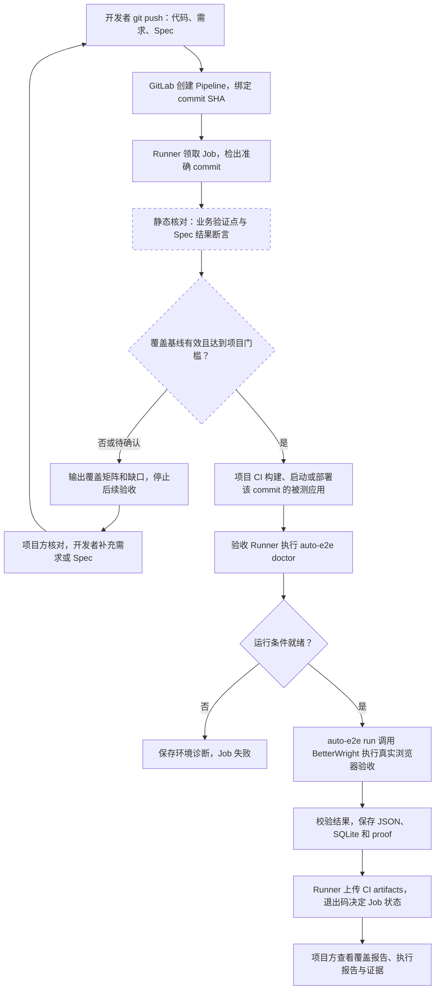

# 从 git push 到覆盖率核对、Runner 验收与报告

本文面向开发、测试和项目负责人，说明一次代码提交如何经过用例覆盖核对、真实浏览器验收，最终形成可追溯的报告。沿用本仓库的 GitLab Runner 集成方案；示例中的目标分支为 `master`，项目使用 `main` 时应同步替换。

**当前能力边界：** auto-e2e 已支持 Spec 执行、结构化结果、SQLite 历史、proof 和本地报告 UI；仓库中的 `auto-e2e-spec-coverage` Skill 用于静态覆盖核对。push 后自动调用该 Skill、校验覆盖基线并按阈值拦截 CI，仍需接入。当前没有 `auto-e2e coverage` 命令，`run` 也不会读取覆盖核对文件或自动补齐用例。

## 1. 整体流程

目标链路如下，虚线框标注仍需接入的覆盖门禁阶段：



覆盖核对也是 CI Job 时，同样需要 Runner 执行。图中的“验收 Runner”强调执行阶段的职责：静态核对与浏览器验收可以共用一台机器，也可以拆为不同 Job。

| 参与方 | 负责的工作 | 交付物 |
|---|---|---|
| 开发者 | 提交代码、需求、Spec 及其资源；补齐遗漏场景 | 可复现的 commit |
| GitLab | 触发 Pipeline、调度 Job、记录状态和保存产物 | Pipeline / Job 记录 |
| 覆盖核对 Skill | 盘点功能和验证点，关联 Spec 断言，识别缺口 | `review.yaml`、`report.md` |
| 项目负责人 / 测试负责人 | 确认功能范围、映射和不适用项 | 带依据的确认记录 |
| GitLab Runner | checkout、准备应用、调用 CLI、上传产物 | Job 日志、原始退出码 |
| auto-e2e + BetterWright | 读取用例、操作浏览器、核对结果并保存证据 | AcceptanceRun、SQLite、proof |

## 2. 提交前要准备什么

被测应用仓库中建议保存以下资料，使需求、用例和代码一起版本化：

```text
my-web/
├── .gitlab-ci.yml
├── docs/requirements/                 # 需求资料，实际位置由项目确定
└── .auto-e2e/
    ├── config.yaml
    ├── specs/
    │   └── search-order/
    │       ├── spec.json              # 步骤、输入和预期结果
    │       ├── inputs/                # 可选：上传文件等输入
    │       └── expected/              # 可选：预期输出文件
    └── coverage/
        ├── review.yaml               # 覆盖映射、摘要和确认记录
        └── report.md                 # 可阅读的覆盖矩阵与缺口
```

`coverage/` 是核对材料的目录，不是运行器配置。项目若有 `coverage/` 忽略规则，应检查这些文件是否实际被版本管理；本仓库使用 `/coverage/` 仅忽略根目录测试产物。不要把映射字段添加到严格校验的 `spec.json` 中。Spec 格式见 [Spec Bundle v2](spec-bundle-v2.md)。

Runner 机器须提前具备当前包要求的 Node.js 22.18.0 或以上版本、固定版本的 auto-e2e、可用的 BetterWright 模型后端、浏览器和目标站点 Profile。初始化与人工登录应在接入 CI 前完成，CI 使用同一运行用户和 Profile。

被测应用必须能够从 Runner 访问。**检出了新代码，并不等于浏览器访问的是新版本。** 项目 CI 需负责构建并启动对应 commit，或部署到可核对版本的测试环境。auto-e2e 只访问 `project.baseUrl` 或 `run --url` 指定的地址，不自动构建、部署应用。

## 3. push 后如何核对覆盖率

### 3.1 覆盖率回答什么问题

这里核对的是：**约定范围内的业务验证点，有多少已经由有效的 Spec 结果断言覆盖？**

例如“按订单号查询”可以包含“已有订单返回正确状态”和“不存在的订单显示空结果”两个验证点。仅有“打开页面并点击查询”的步骤，不能证明这两个业务结果已覆盖。匹配依据应定位到具体 Spec 路径与 `RESULT-*` 断言；旧版 Spec 使用其实际 AC 或 output 引用。

核对过程读取独立的需求资料、菜单、路由、接口和相关实现，再扫描 Spec；不能只用已有 Spec 反推业务范围，否则遗漏的功能永远不会进入分母。只有 Spec、缺少独立功能来源时，全项目覆盖率为 `N/A`。

### 3.2 如何统计

设 `D = 范围内全部验证点数 − 有效人工确认的不适用验证点数`：

| 指标 | 计算方式 | 用途 |
|---|---|---|
| 候选覆盖率 | `(candidate + confirmed) / D` | 查看已找到完整覆盖依据的比例 |
| 已确认覆盖率 | `confirmed / D` | 查看项目方已确认且当前依据仍有效的比例 |
| 执行通过率 | 本次通过的用例或断言数 / 对应声明总数 | 描述运行结果，单独统计 |

同一验证点关联多个用例时只计一次。部分覆盖、未覆盖、未知和需复核的验证点都留在分母。分母为零时显示 `N/A`；范围未确认时比例标为暂估。源码行覆盖率不属于这里的统计范围。

例：10 个适用验证点，其中 7 个已确认、1 个候选、2 个未覆盖，候选覆盖率为 `8/10 = 80%`，已确认覆盖率为 `7/10 = 70%`。即使已有的 8 个场景全部执行通过，也不能据此声称全部需求均已覆盖。

### 3.3 当前核对与目标门禁

当前由 Agent 按 [覆盖率 Skill](../skills/auto-e2e-spec-coverage/SKILL.md) 执行核对，输出覆盖矩阵、缺口与确认记录；具体状态和摘要规则见 [核对文件格式](../skills/auto-e2e-spec-coverage/references/review-format.md)。需求、实现、Spec 或引用资源发生变化后，应重新核对，将失效的确认标记为 `needs-review`，保留历史意见。

要把这一步接到 push 后，需要增加独立的 CI 编排：

1. 基于本次 checkout 重新扫描，或校验已提交基线的范围与证据摘要，防止复用过期结论。
2. 保存本次核对产物，并在 CI 元数据中关联 commit SHA 和 Pipeline。
3. 根据项目约定的范围、风险与阈值判断是否继续，不能仅检查两个报告文件是否存在。
4. 没有有效人工确认时保留待确认状态；CI 不自动代替项目方确认。

例如项目可以约定“关键验证点全部确认覆盖、其余已确认覆盖率至少 90%、没有失效基线”。这只是门禁策略示例，当前 CLI 没有内置该阈值。

门禁未通过时仍应交付覆盖报告，但后续浏览器验收标为“未执行”；不能把未执行显示为测试通过。缺口修复并重新 push 后，重新核对同一条链路。

## 4. Runner 如何执行验收

GitLab 按 push 规则创建 Job，Runner 检出该 Pipeline 的 commit。GitLab 的规则语法和触发条件参见 [Job rules](https://docs.gitlab.com/ci/jobs/job_rules/)。auto-e2e 不负责 `git pull` 或修改工作树。

执行阶段按以下顺序进行：

1. 项目 CI 准备该 commit 对应的应用和测试数据，确认目标地址与版本。
2. Runner 调用 `auto-e2e --non-interactive --json doctor`，检查工具链、配置、Spec 与目标地址；失败时保存诊断并退出。
3. Runner 调用 `auto-e2e --non-interactive --json run`，默认读取 `.auto-e2e/specs`。需要限定范围时使用 `--spec`，报告中应明确实际运行范围。
4. auto-e2e 通过唯一的 BetterWright CLI 适配层执行浏览器任务，收集步骤状态、结果断言、实际观察和 proof。
5. 结果通过领域校验及 AC 完整性检查后保存，再返回最终 JSON 和退出码。`--json` 模式下 stdout 是最终 JSON，进度和日志写入 stderr。

验收 Runner 应串行使用共享 Profile 和测试环境。同一项目的相关 Job 可用 `resource_group` 防止跨 Pipeline 重叠执行，详见 [GitLab resource groups](https://docs.gitlab.com/ci/resource_groups/)。部署阶段也应纳入共享环境的串行控制，或为每个 Pipeline 提供独立环境。

`AcceptanceRun.commit` 记录本地 checkout 的 HEAD；它本身不验证远端部署版本。项目 CI 还应保留被测应用版本信息，并核对与 `$CI_COMMIT_SHA` 一致。

## 5. 当前可接入的最小 CI 示例

以下示例用于**被测应用仓库**，展示已经支持的“doctor → run → 上传报告”。它不包含自动覆盖门禁；覆盖核对当前需事先完成，提交的核对文件仅作为参考材料归档，不代表 CI 已重新检查。

示例假设：专属 Shell Runner 的 tag 为 `local-auto-e2e`，已安装并初始化工具；该 commit 对应的应用已由项目流水线准备好且运行期间版本固定；`.auto-e2e/config.yaml` 省略报告、artifact 和数据库路径。通过 `AUTO_E2E_HOME` 把本次运行数据写入 checkout 内的 CI 产物目录。接入已有流水线时合并 stages，并设置对应用准备 Job 的依赖。

```yaml
stages:
  - acceptance

auto-e2e-acceptance:
  stage: acceptance
  tags:
    - local-auto-e2e
  resource_group: local-auto-e2e
  rules:
    - if: '$CI_COMMIT_BRANCH == "master" && $CI_PIPELINE_SOURCE == "push"'
  variables:
    # 使用新 checkout，避免把上次运行产物误当成本次结果。
    GIT_STRATEGY: clone
  script:
    - |
      set -eu
      cd "$CI_PROJECT_DIR"
      export AUTO_E2E_HOME="$CI_PROJECT_DIR/.auto-e2e-ci/storage"
      mkdir -p .auto-e2e-ci
      printf '%s\n' "$CI_COMMIT_SHA" > .auto-e2e-ci/commit.txt

      doctor_status=0
      auto-e2e --project-root "$CI_PROJECT_DIR" --non-interactive --json doctor \
        > .auto-e2e-ci/doctor.json || doctor_status=$?
      printf '%s\n' "$doctor_status" > .auto-e2e-ci/doctor-exit-code.txt
      if [ "$doctor_status" -ne 0 ]; then
        exit "$doctor_status"
      fi

      run_status=0
      auto-e2e --project-root "$CI_PROJECT_DIR" --non-interactive --json run \
        > .auto-e2e-ci/run-output.json || run_status=$?
      printf '%s\n' "$run_status" > .auto-e2e-ci/run-exit-code.txt
      exit "$run_status"
  artifacts:
    when: always
    expire_in: 14 days
    paths:
      - .auto-e2e-ci/
      - .auto-e2e/coverage/review.yaml
      - .auto-e2e/coverage/report.md
```

这里使用 GitLab 自身的 `artifacts.paths` 收集已有文件，不依赖新增导出参数。`when: always` 用于在普通成功或失败后上传已生成的文件；进程被强制终止、Job 超时或 Runner 失联时不能保证报告完整。路径和保留规则见 [GitLab Job artifacts](https://docs.gitlab.com/ci/jobs/job_artifacts/)。

`doctor` 未通过时没有验收报告，只有已生成的诊断。运行早期异常时，`run-output.json` 也可能只是错误对象或空文件，应结合退出码与 Job 日志判断。脚本保留命令原始退出码，不会因报告收集而把失败改成成功。

此示例上传默认产物目录前，须确保其中只有本次运行数据；不要改成上传整个 `.auto-e2e/` 或 BetterWright 用户目录。密码、Token、Cookie、OAuth 信息和 Handoff 控制令牌不得进入配置或报告。

## 6. 最终有哪些报告，在哪里看

| 产物 | 内容 | 当前查看方式 |
|---|---|---|
| `.auto-e2e/coverage/report.md` | 范围、候选与确认覆盖率、矩阵、缺口 | 阅读 Markdown 或下载 CI artifact |
| `.auto-e2e/coverage/review.yaml` | 可复核的映射、来源摘要和人工确认 | 项目方核对，供下次扫描复用 |
| `.auto-e2e-ci/doctor.json` | 本次环境诊断 | CI artifact，失败时优先查看 |
| `.auto-e2e-ci/run-output.json` | CLI 输出；正常完成时为 `{ "ok": ..., "run": ... }` | CI artifact / 脚本解析 |
| `.auto-e2e-ci/storage/projects/<workspaceId>/reports/acceptance/runs/<runId>/result.json` | 原始 AcceptanceRun，无 CLI 外层包装 | 精确定位某次运行 |
| `.auto-e2e-ci/storage/projects/<workspaceId>/reports/acceptance/latest/result.json` | 最近一次保存的结果快照 | 临时查看；不用于跨 Pipeline 的唯一索引 |
| `.auto-e2e-ci/storage/projects/<workspaceId>/history.sqlite` | 结构化历史 | `list`、`show`、`serve` |
| `.auto-e2e-ci/storage/projects/<workspaceId>/artifacts/<runId>/` | 截图、下载文件等证据 | 本地 UI 或 CI artifact |

在仍保存数据库、配置和 proof 的工作区中，可以运行：

```bash
auto-e2e --project-root /path/to/my-web list
auto-e2e --project-root /path/to/my-web show <runId>
auto-e2e --project-root /path/to/my-web serve --workspace /path/to/my-web --open
```

`serve` 默认监听 `127.0.0.1:4317`，展示历史、用例、步骤、断言和 proof。GitLab 侧当前通过 Job 状态与 artifacts 查看结果；上传 JSON 不会自动产生 GitLab 原生 Test Report，后者还需要待实现的 JUnit 导出。

Runner checkout 会被清理，示例中的 SQLite 也不能因此自动成为长期历史库。下载产物后需连同对应项目配置恢复到合适工作区，保持数据库与 proof 的路径关系，才能由本地 UI 读取。独立持久化目录已通过 `AUTO_E2E_HOME` 支持，迁移及路径规则见 [配置与存储迁移](storage-layout.md)。跨 Pipeline 历史及 JUnit 的目标设计见 [GitLab Runner 集成方案](gitlab-runner-integration.md)；其中的 `--ci-report-directory` 和 JUnit 导出尚未实现。

## 7. 如何判断这次提交是否完成验收

auto-e2e 的退出码决定验收 Job 状态：

| 退出码 | 含义 | 处理方向 |
|---|---|---|
| `0` | 本次所选用例全部通过 | 结合覆盖范围判断是否满足发布条件 |
| `1` | 存在验收失败 | 查看实际值、预期值、差异与 proof |
| `2` | 环境、配置、登录或浏览器阻塞 | 修复条件后重新运行 |
| `3` | 工具自身异常 | 查看诊断和日志，排查工具问题 |

覆盖门禁失败属于前置核对结果，应单独说明原因，不能伪装成上述某个浏览器用例失败。

项目方最终应能顺着 **commit → 覆盖基线 → 被测应用版本 → runId → 断言 → proof** 找到依据。完整闭环要求覆盖基线有效、执行环境对应本次提交、目标用例有明确结果、报告可取回。修复缺口或失败后再次 push，形成下一次独立记录。

## 8. 落地状态

| 环节 | 当前状态 |
|---|---|
| 业务功能与 Spec 的静态覆盖核对 | 仓库已提供 Skill，由 Agent 执行 |
| 人工确认及变化后的覆盖基线复核 | Skill 已约定格式与流程 |
| push 自动触发覆盖扫描与阈值门禁 | 待接入 CI 编排与校验逻辑 |
| Runner 执行 doctor / run | CLI 已支持，项目需配置 Runner 和 Job |
| JSON、SQLite、proof、本地报告 UI | 已支持 |
| GitLab 下载已有报告与证据 | 可通过本文 artifacts 示例接入 |
| 原生 JUnit、统一覆盖率摘要、独立持久化根目录 | 待实现，见集成方案 |

本文仅说明流程与配置示例，不会自动注册 Runner、创建流水线或修改被测应用。
